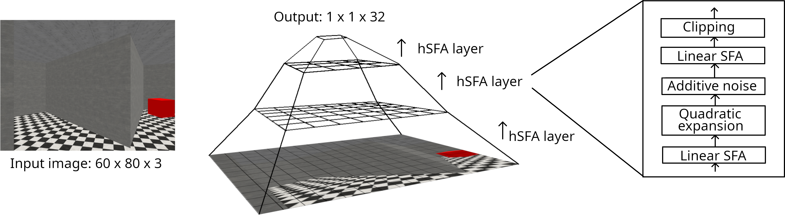

# SFA for Navigation



This code accompanies the paper _Explainable Neuro-Inspired Representations Improve RL Performance on Visual Navigation Tasks_ (more details to follow after publication).

You can create the required Python environment from `environment.yml`. You additionally need to install [this](https://anonymous.4open.science/r/Miniworld-D3D5/README.md) Miniworld fork locally.

## Structure

The repository is structured into the following folders:

- `notebooks` contains code to train hSFA and PCA feature extractors, load logged data from [wandb](https://wandb.ai) and produce plots and tables for the paper

- `scripts` contains scripts to train and evaluate RL agents

- `transformers` contains pretrained hSFA and PCA transformers used for the paper.

### Training feature extractors

You can train the feature extractors with `notebooks/train_feature_extractors.ipynb`.

Make sure to rename the trained hSFA or PCA transformer by appending a suffix such as `starmaze`, `wallgap` or `fourcoloredrooms`.

### Analysing hSFA representations

The resulting hSFA representations, or those generated by the provided pretrained transformers, can be analysed with `notebooks/generate_sfa_plots.ipynb`. This notebook generates the analysis plots used in the paper and can be modified to investigate additional hSFA features, too.

### Training RL agents

_This functionality assumes a [wandb](https://wandb.ai) account for logging._

You can train agents with the script `scripts/train_rl.py`. Make sure to adjust the entity and project name used for wandb logging.

On a headless machine, you can install `xvfb` and then train agents with the following command:

```
xvfb-run -a -s "-screen 0 1024x768x24 -ac +extension GLX +render -noreset" python train_rl.py
```

### Analysing RL agents

_This functionality assumes a [wandb](https://wandb.ai) account to load logs from._

In order to evaluate RL agents, we provide `notebooks/generate_rl_plots_and_table.ipynb`, a notebook which creates plots and values used to evaluate RL agents in the paper. This requires log data in csv form, which first has to be downloaded using `notebooks/wandb_to_csv.ipynb`.

Additionally, you can evaluate the behaviour of agents by deploying them in environments. For this, use `scripts/evaluate_agent.py`. This assumes you provide a run-id from wandb, but you can in principle just provide any path to a locally saved model if you slightly modify the code.

## Citation
To be filled after publication